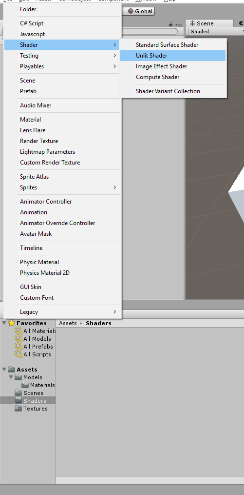
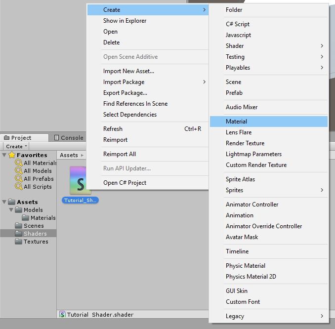
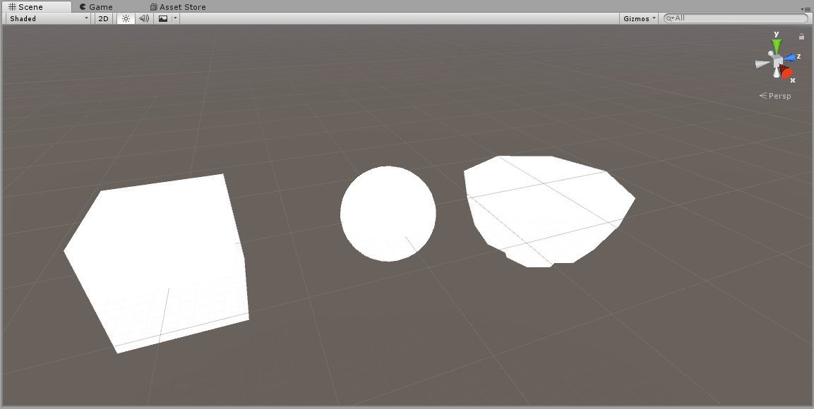

# Unity-Shader-Basics-Tutorial

Welcome, this tutorial is supposed to be a gentle introduction into writing shaders for Unity. It assume you have some previous knowledge in working with Unity but have never touched shaders or materials.

We'll be building up the shader in parts, stopping along the way to show what everything does.

## Part 1: What's a Shader?

Shaders are part of the computer graphics rendering pipeline. They're small applicaitons that tell the computer how to render and shade objects in a scene. This includes calculating the color and light values for a given object so that it can be shown on screen. Ontop of that, shaders are used to create many of the special and post-processing effects that you see in games today. 

In modern game engines, (Including Unity) shaders run in a programmable GPU (Graphics Processing Unit) rendering pipeline, which allow them to run in parallel and do many shader calculations very quickly.

Wikipedia has a great article about shaders [here.](https://en.wikipedia.org/wiki/Shader)

## Part 2: The Rendering Pipeline

For our purposes, we'll simplify the rendering pipeline. Here's a image showing what we'll discuss in this tutorial:


I like to think of shaders as programs that transform one type of information (model data, colours, etc.) to another type of information (pixels/fragments). Object data is data that is inherit to the object. Things such as points in the model, normals, triangles, UV coordinates, etc. Custom Data/Properties are things that we can pass into a shader to use. Things such as colours, textures, numbers, etc.

The first step of the shader pipeline is the vertex function. Vertexes, as you might know, are just points. The vertex function will work with the vertices in the model and prepare them for the next step, the fragment function.

The fragment function will take in vertices and shade them in. Think of it like a painter and their paint brush. It ultimately outputs pixel data, in a (R, G, B, A) format.

Lastly, the pixels are pushed to a frame buffer, where they may be manipulated further (even by other shaders!) until they are drawn on screen.

## Part 3: Scene Setup

So before we start writing some shader code, let's setup our scene. Create a new project in Unity, and import all the assets:

[Bowl Model](./Assets/Models/Bowl.blend)

[Noise texture](./Assets/Textures/Noise.png)

[Bowl texture](./Assets/Textures/Bowl.png)

Add a cube, a sphere, and the bowl model to a new scene and save the scene. Here's what your scene should look like after:


Next, right click in the Project view (Or go to Create) and add a new Unlit Shader. We'll call it "Tutorial_Shader" for now.

*If you're curious about the other kinds of shaders, I'll talk about them at the near the end.*



Then, right click the shader file we just made and go to Create > Material. Unity will automatically create a material that uses that shader with the correct name.

__Note: a "Material" in Unity is just a *instance* of a shader. It just hold onto the custom data/properties.__



Lastly, apply the material to all the objects we've added to the scene by clicking and dragging them to each object.

Everything in the scene should look white and without shadows or shading, like this:



## Part 4: Skeleton of a Unlit Shader

Time to start writing our shader! Let's open our Tutorial_Shader.shader file we create before. You'll see Unity automatically generates some code for us to use/build off of. For the sake of this tutorial, delete all of this and make the .shader file blank.

To start we'll add this code:

```hlsl
Shader "Unlit/Tutorial_Shader"
{

}
```