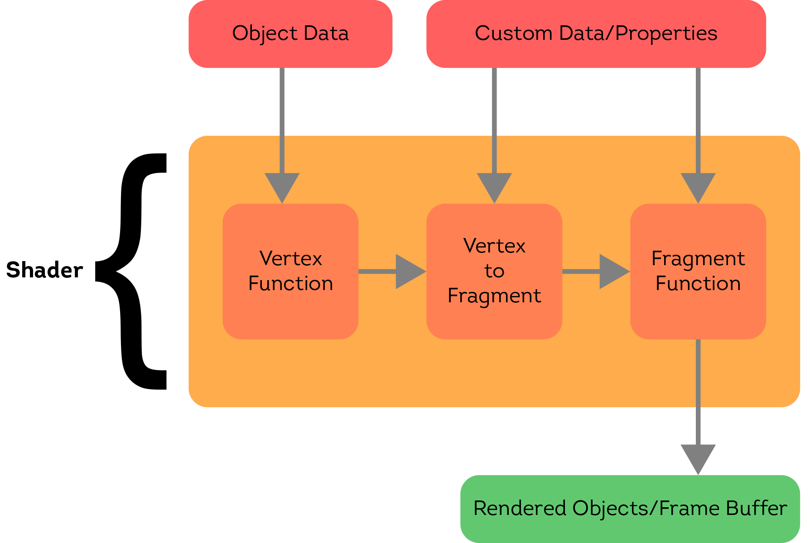
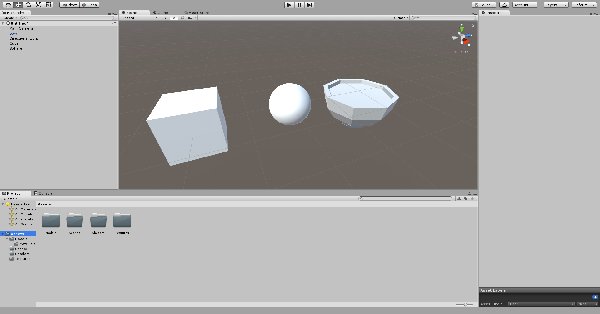
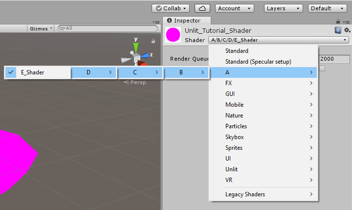
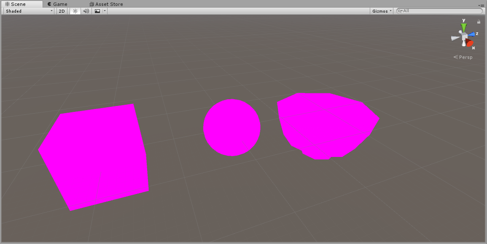
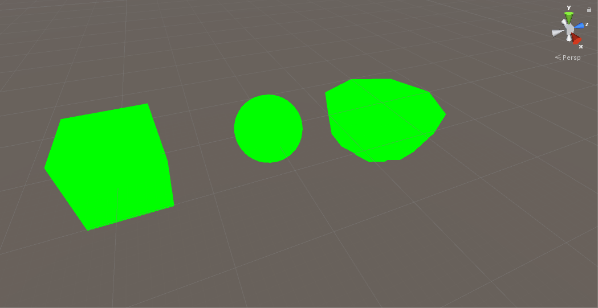
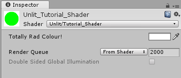
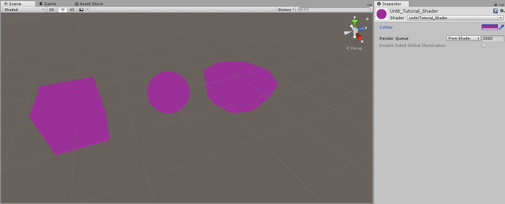
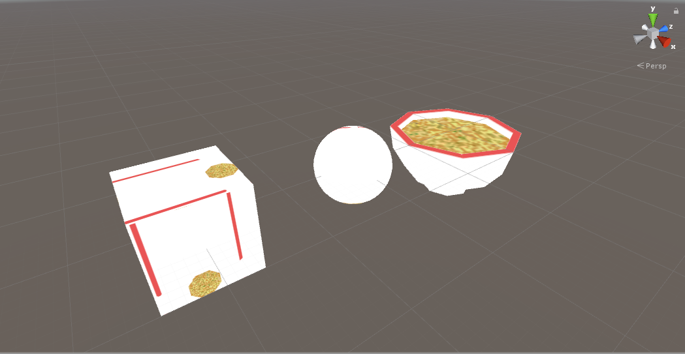
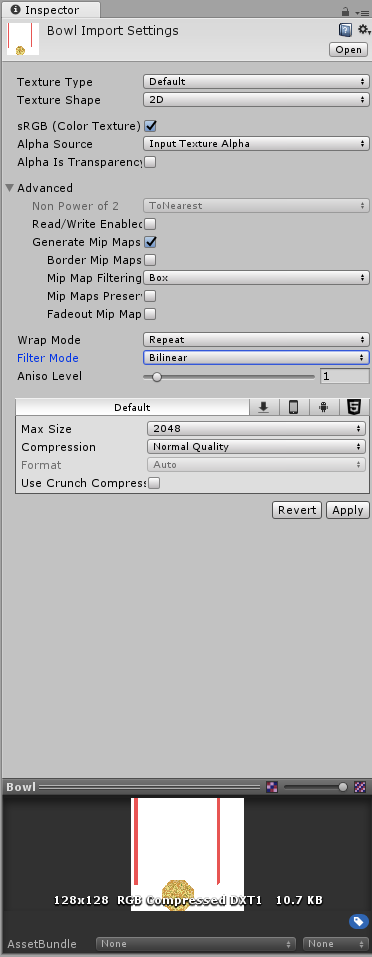
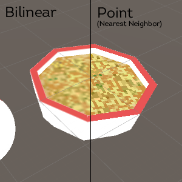

# Unity-Shader-Basics-Tutorial

Welcome, this tutorial is supposed to be a gentle introduction into writing shaders for Unity. It assumes you have some previous knowledge in working with Unity but have never touched shaders or materials.

We'll be building up the shader in parts, stopping along the way to show what everything does.

## Part 1: What's a Shader?

Shaders are part of the computer graphics rendering pipeline. They're small applicaitons that tell the computer how to render and shade objects in a scene. This includes calculating the color and light values for a given object so that it can be shown on screen. Ontop of that, shaders are used to create many of the special and post-processing effects that you see in games today. 

In modern game engines, (Including Unity) shaders run in a programmable GPU (Graphics Processing Unit) rendering pipeline, which allow them to run in parallel and do many shader calculations very quickly.

Wikipedia has a great article about shaders [here.](https://en.wikipedia.org/wiki/Shader)

## Part 2: The Rendering Pipeline

For our purposes, we'll simplify the rendering pipeline. Here's a image showing what we'll discuss in this tutorial:



I like to think of shaders as programs that transform one type of information (model data, colours, etc.) to another type of information (pixels/fragments). Object data is data that is inherit to the object. Things such as points in the model, normals, triangles, UV coordinates, etc. Custom Data/Properties are things that we can pass into a shader to use. Things such as colours, textures, numbers, etc.

The first step of the shader pipeline is the vertex function. Vertices, as you might know, are just points. The vertex function will work with the vertices in the model (Along with other data such as normals) and prepare them for the next step, the fragment function.

The fragment function will take in vertices and shade them in. Think of it like a painter and their paint brush. It ultimately outputs pixel data, in a (R, G, B, A) format.

Lastly, the pixels are pushed to a frame buffer, where they may be manipulated further (even by other shaders!) until they are drawn on screen.

## Part 3: Scene Setup

So before we start writing some shader code, let's setup our scene. Create a new project in Unity, and import all the assets:

* [Bowl model](./Assets/Models/Bowl.blend)

* [Noise texture](./Assets/Textures/Noise.png)

* [Bowl texture](./Assets/Textures/Bowl.png)

Add a cube, a sphere, and the bowl model to a new scene and save the scene. Here's what your scene should look like after:



Next, right click in the Project view (Or go to Create) and add a new Unlit Shader. We'll call it "Tutorial_Shader" for now.

*If you're curious about the other kinds of shaders, I'll talk about them at the near the end.*


Then, right click the shader file we just made and go to Create > Material. Unity will automatically create a material that uses that shader with the correct name.

__Note: a "Material" in Unity is just a *instance* of a shader. It just saves the values of the custom data/properties.__


Lastly, apply the material to all the objects we've added to the scene by clicking and dragging them to each object.

Everything in the scene should look white and without shadows or shading, like this:


## Part 4: Skeleton of a Unlit Shader

Time to start writing our shader! Let's open our Tutorial_Shader.shader file we created before. You'll see Unity automatically generates some code for us to use/build off of. For the sake of this tutorial, delete all of this and make the .shader file blank. 

__Note: All shaders in Unity are written in language called "ShaderLab"__

To start we'll add this code:

```
Shader "Unlit/Tutorial_Shader" {
	...
}
```
These lines of code just specify where the shader code is. The string in quotes after the *Shader* keyword specify to Unity where you'll find the shader.

For example:
```hlsl
Shader "A/B/C/D/E_Shader" {
	...
}
```


If you save your shader and switch back to Unity, you'll notice all our objects now are pink:



This is a fallback shader that Unity will use whenever your shader has errors in it. If you ever get pink objects, you can click on your shader file in the project window and look at the inspector to see the corresponding errors. For now, we'll have pink objects because we haven't completed our shader.

Next up is the properties block:

```
Shader "Unlit/Tutorial_Shader" {
	Properties {
		...
	}
}
```

The properties block is where we can pass in that custom data we were walking about before. Anything we declare here will be shown in the Unity editor for us to change and be exposed to scripting aswell.

Underneath our properties block we'll have our subshader:

```
Shader "Unlit/Tutorial_Shader" {
	Properties {
	}

	SubShader {
		...
	}
}
```

Each shader has 1 or more subshaders. If you're deploying to multiple platforms it can be useful to add multiple subshaders; For example, you might want a subshader that is higher quality for PC/Desktop and lower quality but faster subshader for mobile.

Then we have our pass:
```
Shader "Unlit/Tutorial_Shader" {
	Properties {
	}

	SubShader {
		Pass {
			...
		}
	}
}
```
Each subshader has atleast one pass, which is actually where the object get rendered. Some effects require having multiple passes, but we'll just focus on one for now.

Within our pass, we have the actual rendering code block:
```
Shader "Unlit/Tutorial_Shader" {
	Properties {
	}

	SubShader {
		Pass {
			CGPROGRAM
				...
			ENDCG
		}
	}
}
```
Anything within CGPROGRAM and ENDCG is where we actually write our shading code. For Unity this is a variant of HLSL and CG shading languages.

Next, we'll tell Unity what our vertex and fragment functions are:
```
CGPROGRAM
	#pragma vertex vertexFunction
	#pragma fragment fragmentFunction
ENDCG
```
Here, we're saying we have a vertex function called "vertexFunction", and a fragment function called "fragmentFunction"".

We'll define those functions aswell:
```
CGPROGRAM
	#pragma vertex vertexFunction
	#pragma fragment fragmentFunction

	void vertexFunction () {

	}

	void fragmentFunction () {

	}
ENDCG
```
Before we start shading, we need to setup some data structures and our two functions in a way that we can take Unity's given data and give it back to Unity. First, we'll include *UnityCG.inc*. This file includes a number of helper functions that we can use. If you want a full list of them, you can go [here.](https://docs.unity3d.com/Manual/SL-BuiltinFunctions.html)

We'll also add a data structure called *appdata*, and modify our vertex function so that it takes in a appdata structure:

```
CGPROGRAM
	#pragma vertex vertexFunction
	#pragma fragment fragmentFunction

	#include "UnityCG.cginc"

	struct appdata {

	};

	void vertexFunction (appdata IN) {

	}

	void fragmentFunction () {

	}
ENDCG
```
When we give Unity an argument to call the vertex function with, it will look into the structure of that argument (in this case, our *appdata* structure) and attempt to pass in values to it based on the model that is being drawn. We can define data that we want Unity to pass in by declaring variables like this:

```
[type] [name] : [semantic];
```
So for example, we can ask Unity for the positions of the vertices of this model like this:
```
float4 vertex : POSITION;
```
For now we'll ask Unity to give us the position of the vertices and the coordinates of the UV like so:
```
struct appdata {
	float4 vertex : POSITION;
	float2 uv : TEXCOORD0;
};
```
If you want to learn more about providing vertex data to vertex functions, you can read [here.](https://docs.unity3d.com/Manual/SL-VertexProgramInputs.html)

Lastly for the vertex function setup, we'll create one more struct called *v2f* (which stands for vertex to fragment) that will contain the data we'll be passing into our fragment function. We'll also make sure our vertex function returns data of this struct and create and return a blank one while we're at it:
```
CGPROGRAM
	#pragma vertex vertexFunction
	#pragma fragment fragmentFunction

	#include "UnityCG.cginc"

	struct appdata {
		float4 vertex : POSITION;
		float2 uv : TEXCOORD0;
	};

	struct v2f {
	};

	v2f vertexFunction (appdata IN) {
		v2f OUT;

		return OUT;
	}

	void fragmentFunction () {

	}
ENDCG
```
Just like before we can define some data in v2f that we want to pass from our vertex function to our fragment function.
```
struct v2f {
	float4 position : SV_POSITION;
	float2 uv : TEXCOORD0;
};
```
*If you're curious about SV_POSITION vs POSITION, SV stands for "system value" and represents in our v2f struct that this will be the final transformed vertex position use for rendering.*

Okay we're almost ready, we just need to edit our fragment function. First, we'll modify it to take in the v2f struct and make it return a fixed4 value:
```
fixed4 fragmentFunction (v2f IN) {

}
```
Our output for the fragment function will be a colour represented by (R, G, B, A) values;

Lastly, we're going to add an output semantic SV_TARGET to our fragment function like so:
```
fixed4 fragmentFunction (v2f IN) : SV_TARGET {

}
```
This tells Unity that we're outputting a fixed4 colour to be rendered.
We're now ready to start actually coding the meat and potatoes of our vertex and fragment functions!
Here's our basic skeleton that we've made up to this point:
```
Shader "Unlit/Tutorial_Shader" {
	Properties {
		
	}

	SubShader {
		Pass {
			CGPROGRAM
				#pragma vertex vertexFunction
				#pragma fragment fragmentFunction

				#include "UnityCG.cginc"

				struct appdata {
					float4 vertex : POSITION;
					float2 uv : TEXCOORD0;
				};

				struct v2f {
					float4 position : SV_POSITION;
					float2 uv : TEXCOORD0;
				};

				v2f vertexFunction (appdata IN) {
					v2f OUT;

					return OUT;
				}

				fixed4 fragmentFunction (v2f IN) : SV_TARGET {

				}
			ENDCG
		}
	}
}
```

## Part 5: Shading basics

First thing we'll do is get the correct positions of the vertices. We'll do this using a function called UnityObjectToClipPos() like so:
```
v2f vertexFunction (appdata IN) {
	v2f OUT;

	OUT.position = UnityObjectToClipPos(IN.vertex);

	return OUT;
}
```
What this function does is take a vertex that is represented in local object space, and tranforms it into the rendering camera's clip space. Notice we're passing along the transformed point by setting OUT.position's value.
Next, we'll give an output to our fragment function: 
```
fixed4 fragmentFunction (v2f IN) : SV_TARGET {
	return fixed4(0, 1, 0, 1); //(R, G, B, A)
}
```
And now, the moment you've been waiting for! Save your shader and return to Unity and you'll see our beautiful green objects!



Okay, this probably not that impressive to you, so lets keep building. How about, instead of returning a basic green colour, we edit our shader to return any colour we want? What we'll need to do to achieve this is start working with custom properties.

We can add properties we want to use by following this syntax:
```
name ("display name", type) = default value
```
So for example, we'll expose a colour value like so:
```
Properties {
	_Colour ("Totally Rad Colour!", Color) = (1, 1, 1, 1)
}
```
Here we're defining a colour for us to use, called *_Colour* and it will be shown as "Totally Rad Colour!" in the Unity inspector. We're also giving it a default value of white.
If you save and return to Unity now, when inspect the material, you should see this:



Before we can use this colour, we need to actually pass it into the CG code. Unity does this automatically by binding it by variable name like so:

```
CGPROGRAM
	#pragma vertex vertexFunction
	#pragma fragment fragmentFunction

	#include "UnityCG.cginc"

	struct appdata {
		float4 vertex : POSITION;
		float2 uv : TEXCOORD0;
	};

	struct v2f {
		float4 position : SV_POSITION;
		float2 uv : TEXCOORD0;
	};

	//Get our properties into CG
	float4 _Colour;

	v2f vertexFunction (appdata IN) {
		v2f OUT;
		OUT.position = UnityObjectToClipPos(IN.vertex);
		return OUT;
	}

	fixed4 fragmentFunction (v2f IN) : SV_TARGET {
		return fixed4(0, 1, 0, 1);
	}
ENDCG
```
*I like to put properties after my structs to keep my code organized, but you can put it anywhere so long as its in the top scope of the CGPROGRAM*

We can now use our _Colour value in our fragment function. Instead of returning that green, lets just return whatever colour we want:
```
fixed4 fragmentFunction (v2f IN) : SV_TARGET {
	return _Colour;
}
```
And now, we can save and return to Unity. If you inspect the material and start changing our colour value, you should see all the colours of the objects change accordingly!



Since we now know how to add properties, lets try adding a standard texture map. We'll need a new property for our texture:

```
Properties {
	_Colour ("Colour", Color) = (1, 1, 1, 1)
	_MainTexture ("Main Texture", 2D) = "white" {}
}
```
Notice how it's of type *2D* (2D Texture), and we're defaulting to a blank white texture. We've also need to get the property into CG to use it:

```
float4 _Colour;
sampler2D _MainTexture;
```
Then, we need to give our fragment function the UV coordinates from the model. We can do this by going back to our vertex function and passing them into the v2f struct we return like so:

```
v2f vertexFunction (appdata IN) {
	v2f OUT;
	OUT.position = UnityObjectToClipPos(IN.vertex);
	OUT.uv = IN.uv;
	return OUT;
}
```
Now in order to use the colours from the texture for our fragment function, we need to *sample* it as certain points. Thankfully, CG has a function that does this for us, called *tex2D*.

```
fixed4 fragmentFunction (v2f IN) : SV_TARGET {
	return tex2D(_MainTexture, IN.uv);
}
```
tex2D takes in the texture (ie: sample2D) we want to sample, and the UV coordinate we want to sample with. In this case, we're providing it with out main texture and giving it the point on the model where we want to get the colour from, then returning that result as our final colour. Now, if you save and return back to Unity and inspect the material, we can select the bowl texture for our "Main Texture". You'll see the models update, and the bowl model in particular (the model the texture was made for) should look like a bowl of soup!



__Note: We can change how Textures in Unity are sampled by going back to the texture file and changing the filter mode in the inspector:__




## Part 6: Playing With Shaders

